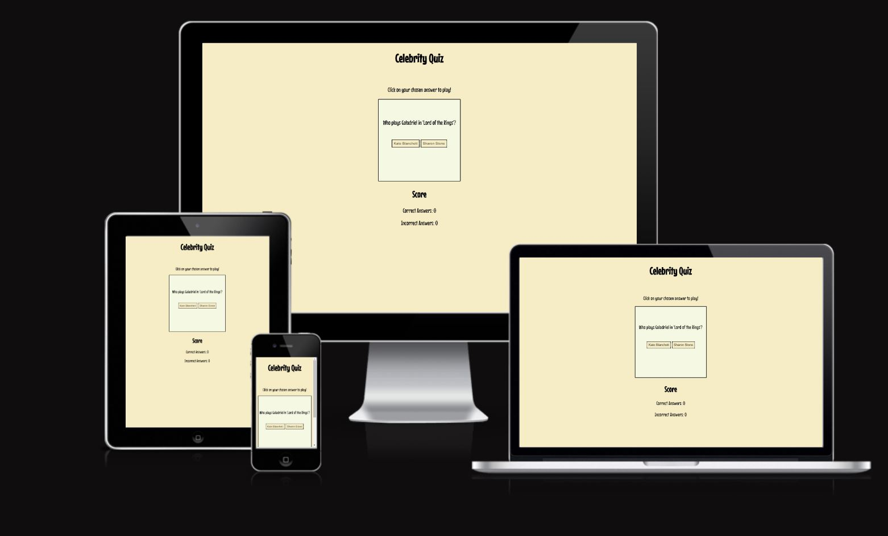
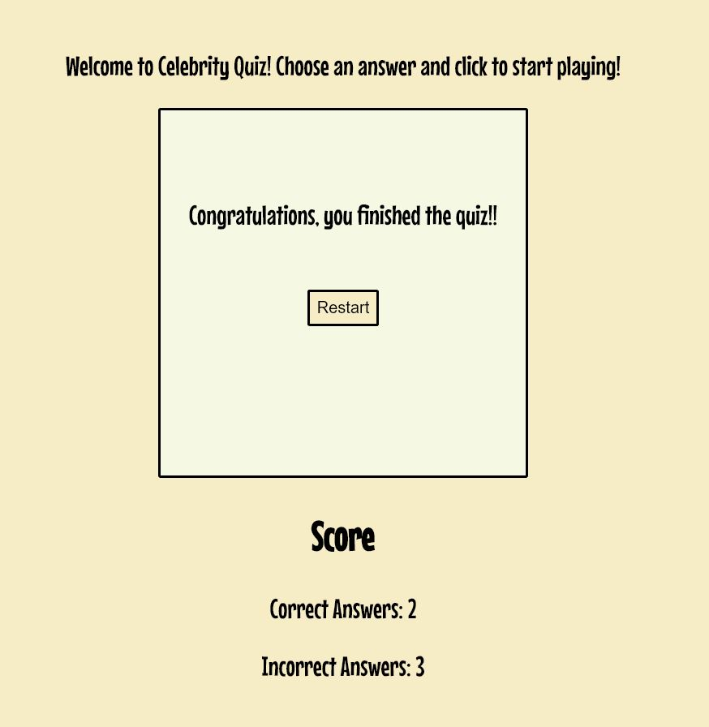

# Celebrity Quiz

Celebrity Quiz is a simple website meant for users who want to tackle a few questions about celebrities in movies. 

## Features 

- __Landing Page__

  This section welcomes the user on the website and provides a self contained experience for people playing on all screens. It provides a welcome message, the main game window, and a Score section that dynamically keeps track of the user's score. 

- __Restart Feature__

  The game allows for people to restart the quiz once they answered all the questions to improve their score. The score will automatically reset to zero once the player restarts the quiz. 

## Testing 

- I've tested the website to ensure that it would work in a responsive way on phones, tablets and desktops. The site automatically resizes depending on the screen size it's viewed on through the use of Flexbox containers. Due to the lack of media queries, after publishing to github pages I personally tested the game on my phone to ensure that it would work correctly on mobile.

- The game's logic has been tested after publishing on Github Pages to ensure that no bugs or errors would pop up only after publication. The game works whatever number of correct or incorrect questions happen to be chosen by the user, and the restart function works correctly.

- The game went through two iterations of the main game loop. After removing the object in the questionArray Array that functioned as end of game screen, a bug appeared; the game would not update the score for the last question answered by the user. It was fixed after the logic that evaluated the correct answer was split from the code checking if the user reached the last question. By splitting that logic into two if statements instead of a single if-else statement, the bug was fixed. 

- The website has been tested for Accessibility through the use of Lighthouse available inside Chrome Developer Tools. 

### Validator Testing 

- HTML
  - No errors were returned when passing through the official [W3C validator](https://validator.w3.org/nu/?doc=https%3A%2F%2Fcode-institute-org.github.io%2Flove-running-2.0%2Findex.html). It returned a warning about the lack of a heading in the main section. Considering that this section is a container for the main game box, a heading was not added. 
- CSS
  - No errors were found when passing through the official [(Jigsaw) validator](https://jigsaw.w3.org/css-validator/validator?uri=https%3A%2F%2Fvalidator.w3.org%2Fnu%2F%3Fdoc%3Dhttps%253A%252F%252Fcode-institute-org.github.io%252Flove-running-2.0%252Findex.html&profile=css3svg&usermedium=all&warning=1&vextwarning=&lang=en#css)
- JS
  - No errors were found when passing through the [JShint Javascript validator](https://jshint.com/) 

## Deployment

The project has been deployed through GitHub pages. It is available at the following link - https://alex-rep.github.io/celebrity-quiz/

## Credits 

The use of the parseInt Function dedicated to evaluate and update the score for the game was repurposed from Code Institute's Love Maths Walkthrough Project. 